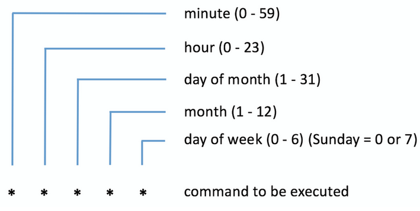

### Процедура запуска компьютера linux

После нажатия кнопки питания запускается:
1. POST - Power on self test Аппаратная диагностика всех основных составляющих
При успешном POST тесте
2. запускается BIOS/UEFI прошивка материнской платы хранящаяся в NVRAM она же инициализирует запуск с первого загрузочного устройства с OC Linux (диск, флешка)
3. После инициализации загрузчика с первых с 512 байт на диске MBR, или на отдельном загрузчике с разделом EFI уже начинает загрузчик самой системы как правило GRUB2. При необходимости можно изменить параметры загрузчика на лету для восстановления Windows или Linux!!!
4. Главная задача загрузчика загрузить ядро ОС в ОЗУ. Ядро управляет аппатными возможностями системы. Само ядро инициализирует устройства и их драйверы, монтирует корневую файловую систему. 
5. Далее редеает процессу инициализации. В современных системах это systemd и процесс PID 1

Существует 2 вида разметки дисков: GPT и MBR:
    MBR - master boot record, основная загрузочная запись. загрузочный сектор в начале диска.Этот сектор содержит загрузчики и данные о разделах диска. Данный формат допускает лишь 4 первичных раздела. 
    GPT - GUID Partition Table форматы таблиц разделов. Современный и актуальный. Каждому разделу на вашем диске присваивается «уникальный глобальный идентификатор» (GUID). отличие от MBR в том, что нет ограничений на количество создаваемых разделов (до 128) и их размер. Поддерживает диски более 2 TB

### Базовые службы linux, обеспечивающие работу ОС и процессы Linux

https://rus-linux.net/MyLDP/consol/hdrguide/rusman/ps.htm справка по ключам ps

https://losst.pro/komanda-ps-v-linux Практические примеры использования команды

Команда ps без ключей выводит информацию о запущенных процессах конкретной оболочки, в которой вы находитесь.

ps -A или ps -e Выводит список всех активных процессов на Linux-системе в generic (Unix/Linux) формате. Та же самая команда, но вывод в BSD формате: ps au или ps aux (в зависимости оттого, какой вывод вам нужен).

ps -x Вывод всех процессов, владельцем которых является ваш пользователь (из под которого выполняется команда).

ps -fu root или ps -fU 0 Вывод процессов конкретного пользователя по его имени или ID.

ps -e --forest Вывод процессов в виде дерева (какие процессы от кого наследуются).

ps -eo pid,user,cmd Вывод процессов в кастомном формате вывода, где будут три колонки: ID процесса, пользователь и команда.

_____

Для вывода всех процессов linux используется команда:

ps -elf | less
ps aux

Параметры:
    -e Вывод всех процессов
    -d Вывести информацию обо всех процессах, кроме лидеров групп.
    -a Вывести информацию обо всех наиболее часто запрашиваемых процессах, то есть обо всех процессах, кроме лидеров групп и процессов, не ассоциированных с терминалом.
    -l long format (расширенный вывод)
    -f полный вывод, включая командную строку (CMD колонку)
    -u список_идентификаторов_пользователей Выдавать информацию только о процессах с заданными идентификаторами или входными именами пользователей. Идентификатор пользователя выводится в числовом виде, а при наличии опции -f - в символьном.
    -x Показать не только устройства с TTY

#### работа с systemd
systemd - актуальная и широко используемая система инициализации и управления службами в Linux.

systemd — это набор демонов, используемых во многих дистрибутивах Linux для загрузки системы.

С помощью systemd работают с установленными программами. Сущность которыми управляет sysyemd называется модулями. Модулями может быть служба, сокет, устройство, точка монтирования, файл или раздел подкачки.

systemctl - инструмент управления systemd

systemctl start [имя] запуск модуля
systemctl stop  [имя] остановка модуля
systemctl status [имя] статус модуля
systemctl restart [имя] перезапуск модуля
systemctl enable [имя] добавить модуль в автозагрузку
systemctl disable [имя] убрать модуль из автозагрузки
systemctl mask [имя] замаскировать сервис (не дать ему запуститься)
systemctl list-dependencies [имя] посмотреть дерево зависимостей (можно без имени для отображения всего дерева)
systemctl list-units список всех модулей systemd

systemctl list-units --type=device посмотреть unitы девайсов

Подробнее тут https://russianblogs.com/article/5858772971/

#### работа с планировщиком задач cron

cron используется для периодического запуска задач по времени
В директории /var/spool/cron/crontabs/ все задачи cron

В директориях 
/etc/cron/cron.{d,daily,hourly,monthly,weekly} хранятся служебные задания cron выполняющиеся: раз в час, день, неделю, месяц

crontab -e редактировать файл crontab для создания задач
    * * * * * echo "run"

crontab -l вывести список заданий

Пять звезд означает периоды повтора где:
    * минуты 0-59
    * часы 0-23
    * дни месяца 0-31
    * месяцы 1-12
    * дни недели 0-7 (от воскресенья)

* * * * * выполнять раз в минуту
*/10 * * * * выполнять раз в 10 минут

0 19 * * 3 /home/torvalds/status_check.py запускать каждую среду в семь часов вечера скрипт status_check.py из домашней директории юзера torvalds

минута, час, день месяца, месяц, день недели (0 = воскресенье) запускаемая команда

https://crontab.guru/ - удобный интструмент для создания заданий

### Основные процессы Linux

OOM killer ([oom_reaper])
Он призван решать проблему нехватки памяти и как вы можете заметить из названия, весьма радикальными методами - “убийством” (SIGKILL) процессов, которые больше всех тратят ресурсы оперативной памяти, когда она закончилась.

OOM killer работает, используя “рейтинг плохишей” (в оригинале: badness score). Каждому процессу он назначает очки от 0 до 1000 в зависимости от потребления оперативной памяти, после чего “убивает” процесс с наибольшим количеством очков. При необходимости, процесс можно защитить от убийцы, выставив минимальный рейтинг, но это чревато паникой ядра и последующим зависанием сервера.

[kthreadd] - PID 2, так называемый “мастер потоков” - это мастер-процесс, создающий процессы для управления аппаратной составляющей. В целом, большинство процессов ниже являются порождениями этого процесса, он как главный босс, раздающий работу и кричащий, что делать.

[rcu_gp] - Read-copy update. Специальный механизм синхронизации данных, позволяющий обрабатывать данные в несколько потоков. Нужен для многопоточной работы с данными.

[kworker/(u)X:X(H)] - процессы которые помогают ядру обрабатывать запросы. Таких процессов может быть много (в зависимости от нагрузки на ядро, чем больше запросов на выделение прерывания, чем больше таймеров и системных вызовов, тем больше процессов по работе в пространстве ядра).

[mm_percpu_wq] - процесс для управления памятью для каждого ядра.

[ksoftirqd/0] - на каждое процессорное ядро ядром Linux порождается один такой процесс, который необходим как для обработки аппаратных прерываний от установленного оборудования, прерываний от установленного программного обеспечения так и обработки исключений возникающих в процессе работы операционной системы. Посмотреть статистику можно в файле /proc/interrupts

[rcu_sched] - дополнительный процесс для корректной работы RCU (это процесс-планировщик).

[rcu_bh] - дополнительный процесс для корректной работы RCU, родственный rcu_sched, отвечает за так называемые “грейс периоды”, они же интервалы времени для завершения RCU-заданий (если простыми словами).

[migration/0] - процесс, которые распределяет другие процессы по ядрам. Один процесс на одно ядро.

[cpuhp/0] - процесс, создающийся 1 на 1 ядро, отвечающий за физическое добавление/удаление CPU в/из систем.

[kdevtmpfs] - заполняет и обслуживает дерево устройств.

[netns] - управляет сетью (фактически оно управляет пространством имен для сетей)

[khungtaskd] - процесс, который каждые две (чаще всего) минуты ищет зависшие задания.

[oom_reaper] - процесс, отвечающий за “убийство” процесса, который потребляет больше всего памяти, если ОЗУ на компьютере заканчивается.

[writeback] - процесс который записывает отложенные в кэше контроллера накопителя данные на сам накопитель. Инициировать можно командой sync

[kcompactd0] - отвечает за так называемое уплотнение памяти (работает по 1 процессу на 1 ядро, обычно - каждые 15 секунд).

[khugepaged] - отслеживает эффективность использование “huge pages” виртуальной памяти.

[crypto] - предоставляет API к крипто-модулю ядра.

[kintegrityd] - проверяет целостность блочных устройств с помощью записи/чтения с/на этих устройств/ах.

[kblockd] - процесс ищет перегрузки в I/O (операциях ввода-вывода).

[edac-poller] - ищет ошибки в памяти и устраняет их.

[devfreq_wq] - процесс  разрешает повторное использование так называемых “рабочих очередей” (workqueues).

[watchdogd] - средство наблюдения за нормальной работой системы, и если происходит какой-то сбой, то данный процесс запускает сброс (reset) системы с целью возобновить нормальное функционирование.

[kswapd0] - древняя, но почтенная система управления виртуальной памятью.

[kthrotld] - контролирует пропускную способность посредством “удушения” запросов в соответствии с приоритетами.

[ipv6_addrconf] - отвечает за конфигурацию очередей IPv6.

[kworker/u2:1-events_unbound] - тот же процесс, что и kworker.

[kstrp] - так называемый “парсер потоков”, он необходим для разбора и анализа сообщений на прикладном уровне.

[ata_sff] - процесс для использования устаревших ide/pata устройств.

[scsi_eh_0] - процесс обрабатывает ошибки, которые могут появляться при подключении дисков, определяемых как scsi-устройства.

[jbd2/vda1-8] - процесс, отвечающий за обновление журнала файловой системы.

[ttm_swap] - процесс, отвечающий за использование GPU памяти.

### Уровни доступа 

В системе Linux есть семь уровней выполнения, которые нумеруются от 0 до 6. Разные дистрибутивы по-разному используют уровни выполнения, так что очень сложно составить список задач, которые выполняет конкретный уровень.

Runlevel 0 завершает работу системы
Runlevel 1 однопользовательский режим работы. Чаще всего используется в целях обслуживания и выполнения других административных задач. Это уровень также может называться runlevel S, где S означает single-user. Если вам когда-то приходилось сбрасывать пароль на Linux, то вы вероятно уже пользовались этим режимом.
Runlevel 2 многопользовательский режим работы без поддержки сетевых служб (демонов).
Runlevel 3 многопользовательский режим с поддержкой сети, но без графического интерфейса. Чаще всего серверные версии Linux работают именно на этом уровне выполнения.
Runlevel 4 не используется. Пользователь может настраивать этот уровень исходя из его целей. О том, как это сделать также будет рассказано далее.
Runlevel 5 этот режим схож с уровнем 3, но тут еще запускается графический интерфейс. В этом режиме работают десктопные версии Linux.
Runlevel 6 этот уровень перезагружает систему.

runlevel вывести текущий runlevel системы
telinit [0-6] изменить runlevel системы

telinit 3 консольный режим

#### Linux system против runlevels

В последние годы systemd сменила многолетнюю систему уровней доступа (System V init). Фактически он работает по тому же принципу, но использует новые команды, которые в целом используют "runlevel" как "target".

Runlevel 0 = poweroff.target (runlevel0.target)
Runlevel 1 = rescue.target (runlevel1.target)
Runlevel 2 = multi-user.target (runlevel2.target)
Runlevel 3 = multi-user.target (runlevel3.target)
Runlevel 4 = multi-user.target (runlevel4.target)
Runlevel 5 = graphical.target (runlevel5.target)
Runlevel 6 = reboot.target (runlevel6.target)

systemctl get-default проверить текущий run level 

### Модули Systemd

Чтобы понять разницу между всеми этими “модулями” или “юнитами”, надо вспомнить, что systemd, как и все остальное в Linux, является файлом. И все systemd-сущности являются разными файлами (например systemd службы хранят конфигурации в файле с расширением .service, а сокеты -  .socket и т.д.). Systemd, если рассматривать как демон, управляет другими демонами и является первым демоном, который запускается во время загрузки ОС.

1. Service unit (служба .service) -  подразумевается самая обычная системная служба

2. Target unit (цель .target) - это юнит, используемый для группировки юнитов по зависимостям. Они выполняют ту же функцию, что и runlevels (уровни запуска, подробнее тут), но принцип работы отличается. Посмотреть список юнитов типа “цель” можно следующей командой: systemctl list-units --type=target

3. Mount unit (точка монтирования .mount) - надстройка systemd, используемая для манипуляций точками монтирования на уровне генерации unit-файлов

4. Automount unit (точка автомонтирования .automount) - похожа на mount unit, но позволяет монтировать ФС только тогда, когда вы действительно хотите обратиться к точке монтирования, например чтобы скопировать какой-нибудь файл

5. Device unit (устройство .device) - юнит для управления девайсами, как определено в sysfs/udev (udev - утилита для управления устройствами). При запуске ОС systemd динамично создает юниты устройств для всех кернел-девайсов, которые помечены udev-тегом “systemd” - к ним чаще всего относятся блочные и сетевые устройства, и некоторые другие. Посмотреть список юнитов можно как и остальные: systemctl list-units --type=device

6. Path unit (файловый путь .path) - используется для наблюдения за файлом или директорий на предмет наличия определенного события, и если это событие происходит, то выполняется запуск service-юнита с таким же именем (если не указан другой). Тут стоит привести более конкретный пример, чтобы было понятнее:

Например есть такой юнит:

[Unit] 
Description=Smotrim za izmeneniyami v faile
[Path] 
PathChanged=/home/some_path/some_file 
Unit=changes_applied.service 
[Install] 
WantedBy=multi-user.target
Он описывает следующее:

Вы наблюдаете за файлом /home/some_path/some_file, и если он меняется, то запускается сервис, определенный в Unit=changes_applied.service.

7. Scope unit (не создаются через конфигурационные файлы, только программно через bus-интерфейсы systemd, имеют расширение .scope) - если говорить просто и коротко - нужен для создания контрольных групп (cgroups) для дерева процессов.

8. Slice unit (слайс имеет расширение .slice) - это юнит, использующий концепт ограниченного потребления ресурсов группой процессов. Тесно связан с cgroups. Юниты, управляющие процессами (обычно это .service и .scope юниты), могут быть назначены конкретному слайсу. И этому слайсу могут быть назначены лимиты потребления ресурсов для всех процессов всех юнитов, собранном в этом слайсе.

9. Snapshot unit (снимок .snapshot) - не конфигурируется через файл. Сам файл.snapshot ссылается на конкретный снимок systemd-состояния. Снимок создается динамично через systemctl snapshot. Снимок работает как сохраненное состояния systemd менеджера.

10. Socket unit (гнездо, сокет с расширением .socket) - обычный сокет, только в виде systemd-юнита. Для каждого сокет-юнита должен быть создан service-юнит, работающий с данным сокетом. Самый обычный сокет выглядит так:

[Unit] 
Description = Socket for echoing 
[Socket] ListenStream = 1111 
Accept = yes 
[Install] WantedBy = sockets.target
Юнит будет слушать 1111 порт, вы также можете указать и полный IP-адреc.

11. Swap unit (файл подкачки или раздел подкачки .swap) - управляет swap-файлами/разделами.

12. Timer unit (таймер .timer) - юнит, позволяющий контролировать сервисы или события, можно назвать его аналогом крона. Имеет поддержку календарных и регулярных событий. Бывают таймеры реального времени (OnCalendar= …) и монотонные таймеры (OnTypeSec= …), где Type - тип события (загрузка OnBootSec, активация юнита OnUnitActiveSec и т.д.)

Рассмотрим отдельно модуль файла планировщика cron

[Unit] - директива, указывающая systemd, что эта часть файла является описательной, указывает параметры запуска и т.д.

Description=Regular background program processing daemon - описание юнита

Documentation=man:cron(8) - указание пути к документации

After=remote-fs.target nss-user-lookup.target - параметр, указывающий, что данный юнит должен запускаться после (after) модуля, указанного справа от “=”.

[Service] - блок конфигурации юнита

EnvironmentFile=/etc/default/cron - файл окружения

ExecStart=/usr/sbin/cron -f $EXTRA_OPTS - команда для старта

IgnoreSIGPIPE=false - параметр для игнорирования SIGPIPE сигнала (SIGPIPE — сигнал, посылаемый процессу при записи в соединение (пайп, сокет) при отсутствии или обрыве соединения с другой (читающей) стороной.)

KillMode=process - указывает, как “убивать” процесс.

Restart=on-failure - указание, когда необходимо перезагружать сервис.

[Install] - блок, описывающий информацию об установке юнита (нужен для команд systemctl enable/disable)

WantedBy=multi-user.target - данная директива, является наиболее распространенным способом определения того, как юнит должен быть включен, от чего зависит.

### Создание собственного сервиса systemd

vi /etc/systemd/system/love.service
    [Unit]
    Description=All you need is love

    [Service]
    #ExecStart=/bin/bash /usr/sbin/love.sh
    #ExecStop=/bin/kill -9 $MAINPID
    StandardOutput=journal+console
    [Install]
    WantedBy=multi-user.target
    
cat /usr/sbin/love.sh
    #!/bin/bash
    while true
    do
    printf "Make love, not war\n"
    sleep 60
    done

Исполнение скрипта должно выводить строку Make love, not war
Смотреть статус сервиса можно командой systemctl status love.service
Запустить systemctl start love.service
Включить в автозагрузку systemctl enable love.service

  

