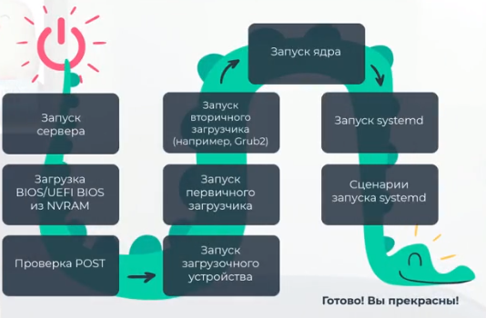

### Процедура запуска компьютера linux

После нажатия кнопки питания запускается:
1. POST - Power on self test Аппаратная диагностика всех основных составляющих
При успешном POST тесте
2. запускается BIOS/UEFI прошивка материнской платы хранящаяся в NVRAM она же инициализирует запуск с первого загрузочного устройства с OC Linux (диск, флешка)
3. После инициализации загрузчика с первых с 512 байт на диске MBR, или на отдельном загрузчике с разделом EFI уже начинает загрузчик самой системы как правило GRUB2. При необходимости можно изменить параметры загрузчика на лету для восстановления Windows или Linux!!!
4. Главная задача загрузчика загрузить ядро ОС в ОЗУ. Ядро управляет аппатными возможностями системы. Само ядро инициализирует устройства и их драйверы, монтирует корневую файловую систему. 
5. Далее редеает процессу инициализации. В современных системах это systemd и процесс PID 1

Существует 2 вида разметки дисков: GPT и MBR
    MBR - master boot record, основная загрузочная запись. Данный формат допускает лишь 4 превичных раздела
    GPT - GUID Partition Table форматы таблиц разделов. Поддерживает диски более 2 TB

