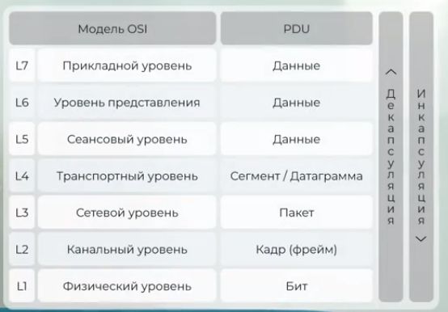
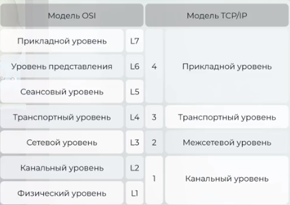
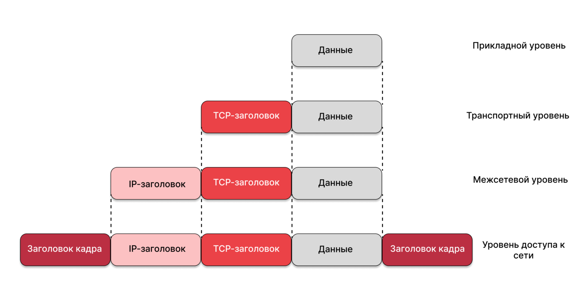
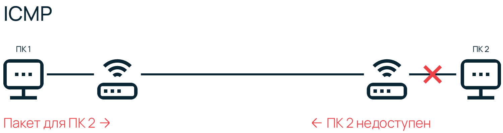
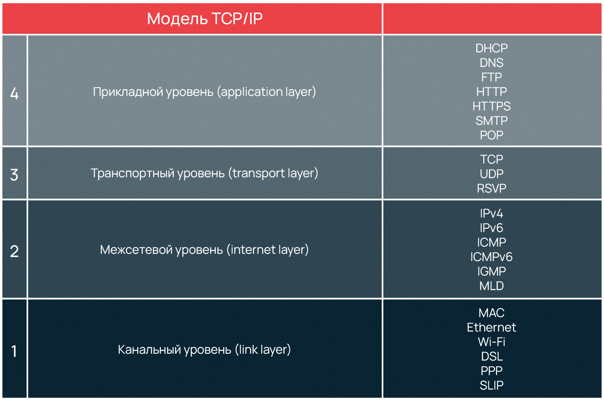
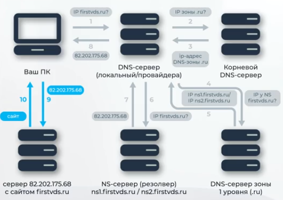
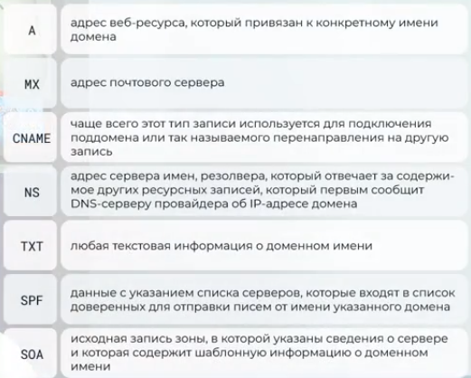

# Как работает интернет. Модель OSI

Basic Reference Model Open Systems Interconnection (OSI) model

Сетевая модель OSI имеет 7 уровней:

на 7 уровне информация представляется в виде данных, на 1 уровне в виде бит
Процесс преобразования данных в биты называется инкапсуляцией, а битов в данные декапсуляцией.

L1 - физический, PDU (единицы нагрузки - бит). На этом уровне работают провода патч панели, сетевые концентраторы, сетевой адаптер
L2 - канальный. PDU (единицы нагрузки - кадр, фрейм). На этом уровне появляется адресация, адресомявляется MAC адрес. Ответственен за доставку фреймов адресату и их целостность. Протокол ARP . Адресация только в пределах 1 сетевого сегмента и ничего не знает о маршрутизации. На L2 работают комутаторы, мосты, драйвера сетевого адаптера
L3 - сетевой. PDU (единицы нагрузки - пакет). На этом уровне появляется маршрутизация. Маршрутизаторы, Роутеры. Получает MAc адерес от L2 и занимается построением маршрута от одного устройства к другому с учетом неполадок сети. На сетевом уровне используется активно ARP (протокол определения адреса). С помощью него mac адреса преобразуются в IP адреса
L4 - транспортный. PDU (единицы нагрузки - сегмент/датаграмма). На этом уровне появляется понятие портов. Задача 4 уровня - транспорт пакетов. Протокол TCP (контролирует целостнось, данные делятся на сегменты)/UDP (датаграмма).
L5 - сеансовый. PDU (единицы нагрузки - данные). TCP/IP . сессии
L6 - представление . Занимается отображение текста, картинок, кодировка Asc2 в utf-8, шифрование данных
L7 - прикладной. протоколы SMTP, RDP, HTTP

Подробнее здесь
https://selectel.ru/blog/osi-for-beginners/

#### Стек протоколов TCP/IP

TCP/IP - Transmission Control Protocol / Internet protocol протокол управления передачей / протокол интернета

Документом, регламентирующим уровневую архитектуру модели и описывающий все протоколы, входящие в TCP/IP, является RFC 1122 https://datatracker.ietf.org/doc/html/rfc1122 (rus http://rfc.com.ru/rfc1122.htm). Он публикуется IETF

К документации по использованию лучше обрашаться к стандарту RFC 1122

Модель TCP/IP

В межсетевом уровне заложен основоной принцип построение интернета. Локальные сети по всему миру объединены в глобальную, а передачу между сетями осуществляет магистральный и пограничные маршрутизаторы.
Для организации были введены маски под сети и Ip адресы.
Маска подсети позволяет маршрутизатору понять как и куда передавать пакет. ПодСетью может являться любая сеть со своими протоколами. Маршрутизатор передают пакет напрямую если получатель находится в той же подсети, если различаются подсети пакет передается на 2 маршрутизатор, со 2 на 3 и т.д. по цепочке пока не достигнет получателя.
Протокол интернета или IP импользуется маршрутизатором чтобы определить какой подсети принадлежит получатель. IP есть у каждого сетевого устройства
В глобальной сети не может существовать 2 устройства с одинаковым IP. 
Сушествует Ipv4 (4 октета - 1 октет 8 бит) и Ipv6.

Маска подсети IPV4 имеет 255.255.255.0

Помимо IP в межсетевом уровне еще задействованы протоколы ICMP и IGMP.
ICMP межсетевой протокол управляющих сообщений используется в качестве поддержки маршрутизаторами и др. сетевыми устройствами. Внутри сети он служит для доставки сообщений об ошибках и операционной информации, сообщающий об успехе или ошибке при связи с другим устройством. Он сообщает о недоступности устройств, используется в ping и traceroute командах.
ICMP не передает какие либо данные что отличает его от протоколов, работающих на транспортном уровне, т.к. TCP, UDP. 

Сетевые устройства объединяются в группы при помощи IGMP протокола группового управления используемымы хостами и роутерами в IPV4 сетях. IGMP организет групповую передачу информации широковещания что позволяет сетям направлять уже сами данные только хостам запросившим ее. Это удобно например для онлайн игр или потоковой передачи мультимедиа  
В сетях IPV6 вместо IGMP используется MLD - multicast Listener Discovery протокол поиска групповых слушателей.

Стеки TCP/IP приложение прикладного уровня общаются также с предыдушим транспортным  и они могу работать с TCP или UDP но понимают только адресное значение в виде IP и порта а не назначение самих данных и принципы их работы.

Ip присваиваются каждому компьютеру межсетевым уровнем, но обмен данными происходит не между компьютерамми, а между приложениями установленными на них. Чтобы получить доступ к тому или иному сетевому приложению недостаточен IP нужен еще порт, такая комюинация называет сокетом или гнездом. 

У приложений на прикладном уровне имеются собственные протоколы для обмена данными, а также фиксированный номер порта для обращения к сети. Администрация адресного пространства Интернет IANA (Internet Asigned Numbers Authority) занимающаяся выделением диапазонов IP твечат за назначение сетевым приложениям портов.
 SMTP - порт 25
 POP3 - порт 110
 HTTP - порт 80
 HTTPS - порт 443
 FTP - порт 21
 DNS - порт 53

# Point-to-Point протоколы

Отдельно расскажем о Point-to-Point (от точки к точке, двухточечный) протоколе, также известном как PPP. PPP уникален по своим функциям, он применяется для коммуникации между двумя маршрутизаторами без участия хоста или какой-либо сетевой структуры в промежутке. При необходимости PPP обеспечивает аутентификацию, шифрование, а также сжатие данных. Он широко используется при построении физических сетей, например, кабельных телефонных, сотовых телефонных, сетей по кабелю последовательной передачи и транк-линий (когда один маршрутизатор подключают к другому для увеличения размера сети).

У PPP есть два подвида — PPPoE (PPP по Ethernet) и PPPoA (PPP через асинхронный способ передачи данных — ATM), интернет-провайдеры часто их используют для DSL соединений.

PPP и его старший аналог SLIP (протокол последовательной межсетевой связи) формально относятся к межсетевому уровню TCP/IP, но в силу особого принципа работы, иногда выделяются в отдельную категорию. Преимущество PPP в том, что для установки соединения не требуется сетевая инфраструктура, а необходимость маршрутизаторов отпадает. Эти факторы обуславливают специфику использования PPP протоколов.

# Что такое DNS и для чего используется эта служба

Чтобы не запоминать числовые адреса интернет-серверов была создана DNS — служба доменных имен. DNS всегда слушает на 53 порту и преобразует буквенные имена сетевых доменов в числовые IP-адреса и наоборот. Служба DNS позволяет не запоминать IP — компьютер самостоятельно посылает запрос «какой IP у selectel.ru?» на 53 порт DNS-сервера, полученного от поставщика услуг интернет.

DNS-сервер дает компьютеру ответ «IP для selectel.ru — XXX.XXX.XXX.XXX». Затем, компьютер устанавливает соединение с веб-сервером полученного IP, который слушает на порту 80 для HTTP-протокола и на порту 443 для HTTPS. 

## Как работает DNS

1. После  ввода URL адреса в браузере, проверяется файл hosts. Если находит возвращает Ip адрес сайта, в противном
2. Свзявается с DNS сервером провайдера/локальный запрашивая IP адрес сайта на который направлен данный домен.
3. DNS провайдер ищет его в своем кеше и возвращает при нахождении.
4. Если в кеше его нет он обращается к корневому DNS серверу которых всего несколько штук по всему миру.
5. Корневой DNS ищет в своей базе DNS корневой зоны домена .ru,.com. и отправялет адрес DNS сервера который хранит DNS домена .ru,.com
6. У DNS домена .ru,.com узнается адрес серверов имен ns сервера или их еще называет reslolverы на который напрален данный домен example.ru например
7. DNS домена представляет эти адреса DNS серверу провайдера
8. DNS сервера провайдеров делают запрос к одному из указазанных ns серверов и получает необходимый IP адрес сервера на котором находится сайт
9. Запоминает данные у себя в кеше для того чтобы не запрашивать эти данные заново
10. Передают эту информацию вашему пк.
11. ПК обращается к хостеру по ip и получает информацию

У каждой записи которая хранится на корневом сервере и DNS провайдера есть время жизни, это означет что она не обновится, пока не кончится это время.

### Dns zona
Информация о ресурсах dns хранится в DNS зоне

A - адрес веб-ресурса, который привязан к конкретному имени домена 
MX - адрес почтового сервера.
CNAME - чаще всего этот тип записи используется для подключения поддомена или так называемого перенапраленияч на другую запись.
NS - адрес сервера имен, резолвера, который отвечает за содедержимое других ресурсных записей, который первым сообщит DNS серверу провайдера об ip адресе домена
TXT - любая текстовая информация о доменном имени
SPF - данные с указанием списка серверов, которые входят в список доверенных для отправки писем от имени указанного домена
SOA - исходная запись зоны, в которой указаны сведения о сервере и которая содержит шаблонную информацию о доменном имени

dig <name_domain> - посмотреть информацию DNS зоны 

dig google.com - инфорцация о DNS в google
dig txt duckduckgo.com - показать txt записи домена
dig mx duckduckgo.com - показать mx записи домена (кто может отправлять почту с домена)
dig +trace duckduckgo.com нагдядный процесс обработки DNS серверов
dig mail.ru @ns1.mail.ru найти DNS IP используя ns1.mail.ru DNS

dig mail.ru any @8.8.8.8 коказать все записи DNS зоны домена
 
dig @xx.xx.xx.xx www.m-system.net +dnssec проверка dns Secirity

## Ip адреса
Все ip делятся на:
 публичные, глобальные, внешние их называют белыми (white ip), 
 частные, локальные, внутренние их называют серым они используются в локальной сети

Частные сети относятся к следующим подсетям:
10.0.0.0 - 10.255.255.255 c маской 255.0.0.0 (10/8 prefix)
172.16.0.0 - 172.31.255.255 c маской 255.240.0.0 (172.16/12 prefix)
192.168.0.0 - 192.168.255.255 c маской 255.192.0.0 (192.168/16 prefix)
100.64.0.0 - 100.127.255.255 c маской 255.192.0.0 (/10 prefix)

https://www.rfc-editor.org/rfc/rfc6598 RFC 6598, зарезервированном IANA префиксе IPv4 для общего адресного пространства

Доступ к сети с таких адресов осуществляется через NAT, меняя приватный адрес на публичный

Частные адреса в пределах одной сети должны быть уникальны

Интерфейс Ethernet к которому как правило сервера, эмулируется виртуальной машиной, идентиыфицируются с использованием имен ethX где X порядок загрузки или ensXY где X номер шины pci разьема, а Y номер слота (aliases для нескольких ip)

ip link  посмотреть список сетевых интерфейсов

## Настройка ip адреса Debian/Ubuntu

Откройте файл /etc/network/interfaces и найдите следующие строки:

    iface eth0 inet static

Данный файл хранит в себе описания настроек сетевых интерфейсов, позволяет настроить маршруты в сети, шлюзы по умолчанию и другие опции
Эта строка и предыдущая задает сетевой интерфейс, он у нас основной
Далее проверяем или записываем, если этих строк нет строки:   

address 10.10.10.10  - здесь указывается основной Ipv4-адрес
netmask 255.255.255.0  - указывается маска
gateway 10.10.10.1 - шлюз

cat /etc/network/interfaces посмотреть и редактировать список сетевых интерфейсов

pointopoint - параметр указывается в случае, если в сети, где расположен ваш сервер используется технология VPU. На серверах с VPU нет общего broadcast-домена, все адреса настраиваются с маской /32. В этом случае сервер считает, что он один в своей сети, и не будет посылать пакеты напрямую узлам — всё будет пересылаться исключительно через шлюз. Однако, при этом нужно явно задать маршрут до шлюза, поэтому просто указать шлюз недостаточно, требуется параметр pointopoint. В нашем случае это 10.10.0.1

auto eth0:1 - число после двоеточия означает порядковый номер дополнительного адреса, начиная с 0, еще эти интерфейсы называют алиасами, или псевдонимами по-русски, так как на деле в интернет мы идем все по тому же основному сетевому порту, просто можем “представиться” другим адресом

iface eth0:N inet static
    address 10.10.10.11
    netmask 255.255.255.255

systemctl restart networking перезапустить и применить изменения

## Настройка ip-адреса для Centos

Откройте файл /etc/sysconfig/network-scripts/ifcfg-eth0 и найдите строки

DEVICE="eth0"

Эта строка задает сетевой интерфейс, он у нас основной.
Следующие строки:
ONBOOT="yes" - чтобы сеть запускалась при старте системы
TYPE="Ethernet" - тип интернет-подключения, для виртуальных машин это почти всегда Ethernet
IPADDR=<Основной IP адрес машины> - указывается основной IPv4 адрес машины
NETMASK=255.255.255.0 - указывается маска (255.255.255.0 - лишь пример), либо
PREFIX=24 - также указывается маска, но формате префикса подсети (24 - лишь пример)
GATEWAY0=37.73.130.1 - шлюз, 37.73.130.1 - лишь пример

Это стандартные параметры, в случае, если в сети, где расположен ваш сервер используется технология VPU, добавляется строка

SCOPE="peer 10.0.0.1" - в нашем примере это 10.0.0.1
Также для VPU нужно добавить прямой маршрут в файле /etc/sysconfig/network-scripts/route-eth0 (если его нет - создать) и заполнить его данными:

ADDRESS0=0.0.0.0
NETMASK0=0.0.0.0
GATEWAY0=10.0.0.1
После изменений, для применения изменений можно выполнить команду

systemctl restart network.service
Примененные изменения можем увидеть командой ip a
Теперь проверим, указан ли шлюз по умолчанию. Команда ip r покажет имеющиеся маршруты:

## 

Включить / отключить сетевой интерфейс
ifup eth0 / ip link set eth0 up - Включить сетевой интерфейс
ifdown eth0 / ip link set eth0 down - Отключить сетевой интерфейс

ip route посмотреть маршруты сети

ping 8.8.8.8 - ping для проверки связи через ICMP протокол (Windows по умолчанию запрещает ICMP запросы)

apt-get install traceroute установка traceroute debian/ubuntu
yum install traceroute установка traceroute centos

traceroute 8.8.8.8 показывает наглядно прохождение пакетов по сети

apt-get install mtr-tiny установка mtr-tiny debian/ubuntu
yum install mtr установка mtr centos

apt install mtr-tiny - установка утилиты для обнаружения потерянных пакетов (нестабильная связь) / для Windows есть winmtr

mtr <Ip компьютера> # на 2 компьютерах

--- Для Ubuntu/Debian
curl -s https://install.speedtest.net/app/cli/install.deb.sh | bash установка утилиты speedtest
apt install speedtest-cli устновка speedtest
speedtest-cli измерение скорости сети

--- Для Centos
curl -s https://install.speedtest.net/app/cli/install.rpm.sh | sudo bash
yum install speedtest
speedtest

